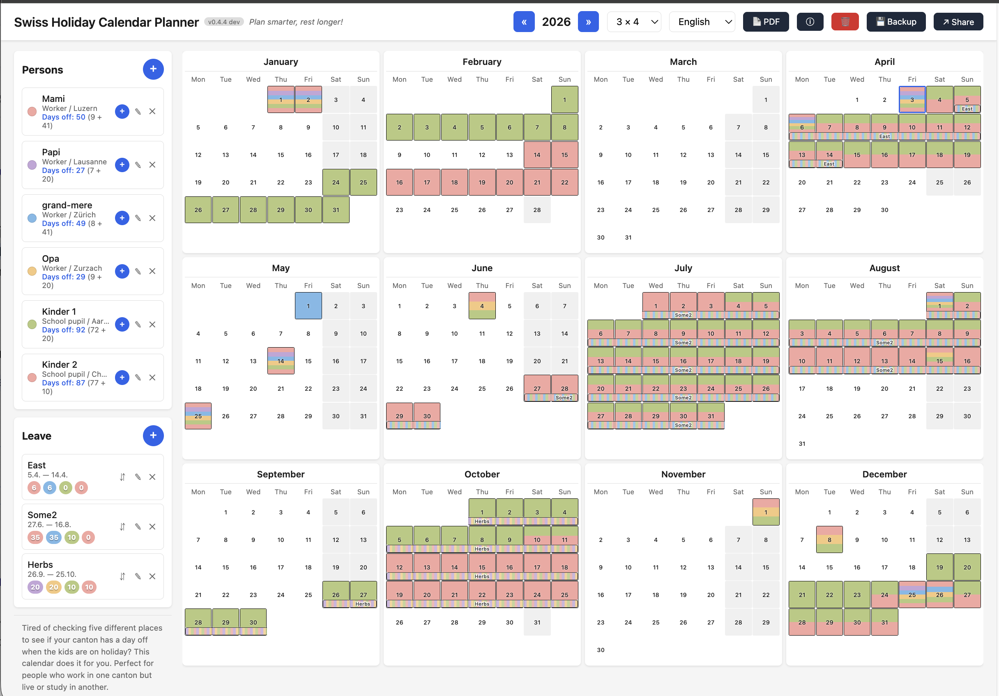

# HCP - Holiday Calendar Planner Swiss & German 

Plan smarter, rest longer!

A calendar tool that helps families in Switzerland optimize their vacation planning when family members work or attend school in different cantons. Parents and children each have different holiday schedules (public holidays, school holidays, university holidays) depending on their canton and municipality — HCP visualizes all of them on one calendar so you can find the best overlapping days off.

Browser-based, offline-first, all data stored locally in IndexedDB.

**[Live Demo with sample family](https://hcp.sysop.cat/?share=eJzNnc1y2zYQx1-Fgx5ykToiZcuMbs6Hm04-Z5xJps3kAJOQhJQEVQB0JvbkAfoanVzS9thjbnqxDiiJMjcGkkuxe0soEvsjQfwXWOKfXLNLNk9H7AObZ5NsNmIVV0s2Z0KxEVuz-ZtrpticPeW1ZCNWsDl73-jfhGYj5k5LJ7PU_dGd86S9EtpdVlRszn5YHPEZn7CPo20LL_j61haOj_NZ3wJvDVdK9G0UUz4r876NpeaqHNdCi9tayg4ov26-aFms-nZOiou74tDO8zW_rYGjaXbUt9DqK36jhcWsyE9E38JjqUqhk3TXjClWTVPtm5lMepBTrnnbN3KRF3e_biS7rZHjo8l038j9lTBGVF892bcjtup6aC3ZfDJipXsIk2w2nqTjDsGwOauFcgDVBZtfs1KwOXsm2nd8pY3lSzZiC-0ONe2lqJJT13vSupB83ZRcqYaN3KvgLnqf_CK4vmOSB_wD--ju4bawmTfsPaGLlW2q8mbgLHnH1aXsuqALnCVLoRSXfeD-smDko3H3uG6P_JjrhRbyRthXQpValDIxXCq7j_1KKKHLzT-J4cr2AD81TZmcaVmGgs-8wZ8bK3TdqBvRn7SqlEkpkhebP39vhdnHf9Iq4cKXMnnBze8t3yM85K6R5Gmj_BDH4_TIC3HaLhZ8pe2e4NQUQhnZ9P3dHxD7mP2RwFM_HmfH3pgvFlItjfXdulBWFJt_rbjt7rsfG2N7mtcracP37_rBy3KmG1UJWawUr_coZ5u_rBg_kKLtX_pGr1uTPGhqqeQ-8u7g_ZWWxkpP8Dw03u61qhRmIaTQN55EFz5R3MpG8ap_CmfCWJ4oftUf7ijO30tjkme7swNdko9Tf5c85VpuPiWPZF2LCrwQpqnXdvBGmFZdDd8I027PSZpF8pRrD0MaVJ_TqhJ6JWQll12O6cK_bFozGIrPl0oaNwz7fjitquTcnWLu-G8_zcaT_Fu3_7BeLzaflIuwj_9zXfOirTafRXK_UYUYPInux6bith-Pu9O5HZzuIwqMkddCrhQvVnYoxpu_q33wZ9zeeA22b2HNA1LoAvrV6NyK9Yqrm-G6hzre_GGl2KbeLu65k8Dk3IoFPySBc_tj0rUgFFTjFCf9wLDx0k-KmX5gcJT0kyKkn5RQ-knJZIA0tuBkOKMdho032jPM0Q6Do4z2bDjyAl3-ki8Tt6451RdC2uHbXraJ1fySy2r4upeiSip-2ej-STzhF02rA70QSXEyQoqTkVGcDFNxkKY4UxzRg2Hjid4UU_RgcBTRmyIIzpSQ4EwxV9hTMmo3JbDCnuKtsKfkVtjT2OkHBkRIP0fDPJD5x-L5utF2IbQ8dP8rXnBVCOOEwbive0V2P1ztDsrLw3Bwf09WTeVU2fgp_E8-JkWgOyJSnJCg8I_OmBR3KVBMJyQo_FIdjSILJYyYFP7Za0wK_0w2JgUBBc_GEwIKnoWm9zEpCCh4cH4VjSK42jvTmy-ryq09_ChrLZUV9dpAnFK632p-KTQ_IGmppt_BFFp_YDH5xw8ek3804TH5xxYek3-k4TH5Z05oTKl_HoXH5J_P4DH5Zzd4TAR1PFBHw2MiqOMpQR1PCep4SlDHU3I6fhJccTR1LbSP587ms918hijCDOaVrWvhOyACC454EIH1RjyIwHIjHkRgtREPIlAuigYRmOVEhAiUaeJBBKo08SACRZp4EBQUMzA1iQhBQTEDk4-IEBQUMzC9iAeRUVDMjIJiZhQUM6OgmKHvkvEgKChm6KtkPAgKihn6JhkPgoJihr5IxoPAV8zgdp6IEPiynQe_RsaDwJftnEJpIKdQGsgplAZyCqWBnEJp4G4olT8S-sJ4v8ne4a1t6sOmrz0Gb22rFK8Om-9a29bqO0j8L0ZsEv_bEZvE_4pEJgmk95gk6SSUXmOT-HNsbBJ_oo1N4s-2sUn8KTc2CQ2NdSQ0NNaR0NBYR0JDY9NJqEwfm4SIxmahauBhA7z_Y-NgP_yND42-rfHf5AkUBnF4_D2Fw-PPiTg8_syIw-PPjzg832Mwicnjz5U4PP6MicPjz5s4PMT0ObBOweGho88n3_D24vDQyRdbHkr5IqIXG4aN58UeRI7kRAYxUZ3IA5bYTmRQkkTx_w4UM67_F4g1Af_v8dAxE9ql8z86ZiAFjpMKUuA4qSAFjpMKUuA4qSAFjhcWUIT26kSkwHGhQgocF-qAgojDDjJRcGZAJgrODMhEwZkBmSg4MyATBWcGZKLgzABMJBx2kImCww4yUXDYQSaCOk7CYQeZCOo4CYcdZCKo4yQcdpCJnI7PkLbbQgiUfVsQAmXfFoDA2W47gDhB2ukKIVB2ukIIlJ2uEAJlpyuEQNnpCiFQdrpCCHzFxDLBQgh8xcQywUIICoqJY4KFEBQUE8cECyEoKCaOCRZCUFBMHBMshKCgmDgmWAhBQTFxTLAQgoJi4phgIQQFxcQxwUIICopJYFWOZYIFECRW5Tgm2AEElgkWQuDLNpYJFkLgyzaWCRZC4Ms2lgkWQuDLNpYJFkAQKA3kFEoDOYXSQE6hNJBTKA0E92NGhEBXTFxvHCTB88ZBEjz_MSTB8x9DEjz_MSTB8x9DEjz_MSTB8x9DEjz_MSTB8x8DkkC9LzYJGY0NVP5ik5DR2EANMDYJEY0l4OuFPNi-XsiD7euFPNi-XsiD7euFPNi-XsCD7uuFPNg-2gMPDV8v5MH29UIebF8v5KGTL7Y8dPLFlodOvtjy0MkXWx46-WLLQydfdDyBelH8fBHRxw_DxvPxDyJH8vGDmDg-_rcjVrH5m-suXPf_re8oBjY_AT0sjv_NZJSNjkbHb90NdZefN7XIBtfvtt4frt9VZG-_vlv2DK7f_RufAi6buuvT0XR7_duP_wElgAr0)** — click to see a pre-filled calendar with a Swiss family across multiple cantons.



## How to use

Just open **[hcp.sysop.cat](https://hcp.sysop.cat/)** in your browser — no installation, no account, no setup needed.

All your data is stored locally in your browser's cache (IndexedDB). Nothing is sent to any server — everything stays on your computer. If you clear your browser data or switch to a different device, your calendar will be empty again.

**Remember to make backups!** Use the Backup button to download a JSON file with all your data. You can restore it anytime with the same button. This is the only way to transfer your calendar between devices or protect it from being lost.

---

## For developers

The sections below are for developers who want to run HCP locally or contribute to the project.

### Quick Start

```bash
npm install
npm run dev
```

Open [http://localhost:5173](http://localhost:5173).

### Docker

```bash
docker-compose up -d
```

| Service | Port | Description |
|---------|------|-------------|
| **HCP** | [localhost:8080](http://localhost:8080) | Calendar app (nginx, read-only) |
| **GoAccess** | [localhost:7891](http://localhost:7891) | Real-time access log dashboard |

Logs are persisted in a shared Docker volume (`nginx-logs`) between the HCP and GoAccess containers.

#### Security

- Read-only filesystem (`read_only: true`)
- Non-root nginx user (uid 101)
- `no-new-privileges`, `cap_drop: ALL`
- CSP, X-Frame-Options, X-Content-Type-Options headers
- Input escaping, color sanitization, share URL payload validation

### Production Build

```bash
npm run build
npm run preview
```

Static files output to `dist/`.

## What can you do with HCP?

### Add your family members
Add each family member — parents, children, grandparents — and assign their municipality (Gemeinde). The app automatically knows which public holidays, school holidays, or university holidays apply to each person based on their canton.

There are three types of people you can add:
- **Workers** — sees the official public holidays for their canton
- **School pupils** — sees school holidays and public holidays combined
- **Students** — sees university holidays and public holidays combined

Each person gets their own color on the calendar, so you can tell at a glance who has time off and who doesn't.

### See everything on one calendar
The full year is displayed on a single page. Holidays from the database are shown as solid colored blocks; holidays you add manually appear with a striped pattern so you can tell them apart. You can switch between different layouts (3x4, 2x6, 4x3, 6x2, 1x12, 12x1) to find the view that works best for your screen.

### Plan your vacations together
Add leave periods and assign them to one or more family members. The calendar shows vacation bars so you can immediately see where everyone's time off overlaps — that's where you want to plan your family trips.

### Count working days
The app calculates the net number of working days for each person, excluding weekends and all applicable holidays. Useful when you need to plan how many vacation days to request from your employer.

### Works in 4 languages
German, French, Italian, and English — the app auto-detects your browser language.

### Share your calendar
Share your entire calendar setup with family members via a compressed URL link. They can open it in their browser and see the same view. You can also export a PDF with a QR code for easy sharing on paper.

### Your data stays private
Everything is stored locally in your browser (IndexedDB). No account needed, no server, works completely offline. Use the Backup/Restore feature to save or transfer your data as a JSON file.

### Automatic year carry-over
When you switch to a new year, all your people and their holiday assignments carry over automatically — no need to set everything up again.

## Holiday Data

### Data Sources

All holiday data is derived from official government and institutional sources. The source PDF files are stored in the `datasource/` directory.

#### Switzerland (CH)

| Source | Type | URL | Used for |
|--------|------|-----|----------|
| **EDK/CDIP Schulferien 2026** | PDF | [edudoc.ch/record/235166/files/Schulferien_2026.pdf](https://edudoc.ch/record/235166/files/Schulferien_2026.pdf) | School holidays for all 26 cantons (2026) |
| **EDK/CDIP Schulferien 2027** | PDF | [edudoc.ch/record/240657/files/Schulferien_2027.pdf](https://edudoc.ch/record/240657/files/Schulferien_2027.pdf) | School holidays for all 26 cantons (2027) |
| **Kantonal-einheitlicher Ferienplan (BKS)** | PDF | [schulen-aargau.ch/.../bksvs-kantonal-einheitlicher-ferienplan.pdf](https://www.schulen-aargau.ch/media/schulen-aargau/schulorganisation/ressourcen-planung/stunden-ferienplanung/bksvs-kantonal-einheitlicher-ferienplan.pdf) | School holidays for canton Aargau (AG), from the Erziehungsrat Ferienplan |
| **Kantonale Feiertage** | PDF | [bj.admin.ch/dam/bj/de/data/publiservice/service/zivilprozessrecht/kant-feiertage.pdf](https://www.bj.admin.ch/dam/bj/de/data/publiservice/service/zivilprozessrecht/kant-feiertage.pdf) | Official public holidays per canton (fixed + moveable dates) |
| **Universität Zürich Semesterdaten** | Web | [uzh.ch/de/studies/dates](https://www.uzh.ch/de/studies/dates.html) | University semester breaks (students.json) |
| **swisstopo PLZ/Ortschaften** | Data | [data.geo.admin.ch/ch.swisstopo-vd.ortschaftenverzeichnis_plz](https://data.geo.admin.ch/ch.swisstopo-vd.ortschaftenverzeichnis_plz/) | Municipality database (2123 Gemeinden with BFS number, canton, PLZ, language) |

#### Germany (DE)

All sources below are free, require no API key, and have been verified as working.

| Source | Type | URL | Used for |
|--------|------|-----|----------|
| **Destatis GV-ISys** | CSV/XLS | [destatis.de/.../Gemeindeverzeichnis](https://www.destatis.de/DE/Themen/Laender-Regionen/Regionales/Gemeindeverzeichnis/_inhalt.html) | Authoritative municipality register — all Gemeinden with AGS code, Bundesland, Kreis |
| **OpenPLZAPI** | JSON API | [openplzapi.org](https://openplzapi.org/) | Municipality lookup with PLZ, name, Bundesland. Search-based: `/de/Localities?name=Berlin` |
| **OpenHolidaysAPI** | JSON API | [openholidaysapi.org](https://openholidaysapi.org/) | Public holidays + school holidays in one API. `/PublicHolidays?countryIsoCode=DE&validFrom=2026-01-01&validTo=2026-12-31` |
| **date.nager.at** | JSON API | [date.nager.at/api/v3/publicholidays/2026/DE](https://date.nager.at/api/v3/publicholidays/2026/DE) | Public holidays per Bundesland with subdivision codes |
| **feiertage-api.de** | JSON API | [feiertage-api.de/api/?jahr=2026&nur_land=BY](https://feiertage-api.de/api/?jahr=2026&nur_land=BY) | Public holidays per Bundesland with detailed notes |
| **ferien-api.de** | JSON API | [ferien-api.de/api/v1/holidays/BY/2026](https://ferien-api.de/api/v1/holidays/BY/2026) | School holidays per Bundesland and year |
| **KMK Ferienregelung** | PDF | [kmk.org/service/ferien.html](https://www.kmk.org/service/ferien.html) | Official school holidays PDF (authoritative source, all 16 Bundesländer) |

Source files in the repository:
```
datasource/
├── Schulferien_2026.pdf                        # EDK/CDIP school holidays 2026
├── Schulferien_2027.pdf                        # EDK/CDIP school holidays 2027
├── kant-feiertage.pdf                          # cantonal public holidays (BJ)
└── bksvs-kantonal-einheitlicher-ferienplan.pdf # AG school holidays (Erziehungsrat)
```

### Swiss Cantons (26 cantons, 2025-2035)

Public holidays are computed dynamically (Easter algorithm + fixed dates) and stored as `workers_YYYY.json`. The source table is parsed from `datasource/kant-feiertage.pdf` (Bundesamt für Justiz).

Generation:
```bash
python3 tools/parse_feiertage.py --years 2025 2026 2027 2028 2029 2030
```

### School Holidays

Parsed from official EDK/CDIP PDFs (`datasource/Schulferien_YYYY.pdf`). Canton AG uses data from the official Erziehungsrat Ferienplan (`datasource/bksvs-kantonal-einheitlicher-ferienplan.pdf`).

```bash
python3 tools/parse_schulferien.py Schulferien_2026.pdf Schulferien_2027.pdf
```

### Universities

Student holiday data is available per university. Users select their university by name in the municipality field.

#### Switzerland (20 universities)

| University | Code | Canton |
|-----------|------|--------|
| Universität Zürich | UZH | ZH |
| ETH Zürich | ETH | ZH |
| Université de Genève | UNIGE | GE |
| Université de Lausanne | UNIL | VD |
| EPFL Lausanne | EPFL | VD |
| Universität Bern | UNIBE | BE |
| Universität Basel | UNIBAS | BS |
| Université de Fribourg | UNIFR | FR |
| Universität St. Gallen | HSG | SG |
| Universität Luzern | UNILU | LU |
| Université de Neuchâtel | UNINE | NE |
| USI Lugano | USI | TI |
| ZHAW Zürich | ZHAW | ZH |
| BFH Bern | BFH | BE |
| ZHdK Zürich | ZHdK | ZH |
| FHNW Windisch | FHNW | AG |
| OST Rapperswil | OST | SG |
| ZHAW Winterthur | ZHAW-W | ZH |
| HSLU Luzern | HSLU | LU |
| FH Graubünden | FHGR | GR |

#### Germany (13 universities)

| University | Code | Bundesland |
|-----------|------|------------|
| LMU München | LMU | BY |
| TU München | TUM | BY |
| FU Berlin | FU | BE |
| HU Berlin | HU | BE |
| TU Berlin | TU | BE |
| Universität zu Köln | Uni Köln | NW |
| Goethe-Universität Frankfurt | Goethe | HE |
| Universität Hamburg | Uni HH | HH |
| RWTH Aachen | RWTH | NW |
| WWU Münster | WWU | NW |
| Universität Heidelberg | Uni HD | BW |
| Universität Stuttgart | Uni S | BW |
| TU Dresden | TUD | SN |

### Data Format

Holiday data follows a standardized schema (`src/db/seed/holidays/_schema.json`) designed for future automated parsing via Go + AI.

```
src/db/seed/holidays/ch/
├── school_2026.json      # school holidays per canton
├── school_2027.json
├── workers_2026.json     # public holidays per canton
├── workers_2027.json
└── students.json         # university holidays (20 universities)

src/db/seed/holidays/de/
├── school_2026.json      # school holidays per Bundesland
├── school_2027.json
├── workers_2026.json     # public holidays per Bundesland
├── workers_2027.json
└── students.json         # university holidays (13 universities)
```

### Adding a New Year (existing country)

1. Generate worker holidays: `python3 tools/parse_feiertage.py --years 2036`
2. Parse school holidays: `python3 tools/parse_schulferien.py Schulferien_2036.pdf`
3. Bump `SEED_VERSION` in `src/db/store.js`
4. Build and deploy

### Adding a New Country

The app supports multiple countries. Each country has its own directory under `src/db/seed/holidays/` and its municipalities in `gemeinden.json`. To add a new country (e.g. Austria `at`):

#### Step 1: Create the holiday directory

```
src/db/seed/holidays/at/
├── workers_2026.json     # public holidays per region
├── school_2026.json      # school holidays per region
└── students.json         # university holidays (or empty [])
```

#### Step 2: Add municipalities to `gemeinden.json`

Each municipality needs these fields:

```json
{
  "id": "at-40101",
  "name": "Linz",
  "canton": "OO",
  "country": "AT",
  "language": "de",
  "plz": ["4020", "4021"]
}
```

- **`id`** — unique identifier (prefix with country code to avoid collisions, e.g. `de-09162`, `at-40101`)
- **`canton`** — regional code (Bundesland, province, etc.). Must match the `canton` field in holiday JSON files
- **`country`** — ISO 2-letter country code (`CH`, `DE`, `AT`, ...)
- **`plz`** — array of postal codes for autocomplete search

#### Step 3: Create holiday JSON files

Holiday files follow the schema in `src/db/seed/holidays/_schema.json`. Each file is an array of entries grouped by region:

```json
[
  {
    "canton": "OO",
    "year": 2026,
    "holidays": [
      {
        "name": { "de": "Neujahrstag", "en": "New Year's Day" },
        "start": "2026-01-01",
        "end": "2026-01-01",
        "type": "public_holiday"
      }
    ]
  }
]
```

- **`canton`** — must match the region code used in `gemeinden.json`
- **`type`** — one of: `public_holiday`, `vacation`, `bridge_day`
- **`name`** — multilingual object; at minimum provide `de` and `en`

For `students.json`, entries reference a specific municipality:

```json
[
  {
    "gemeinde_id": "at-40101",
    "year": 2026,
    "category": "student",
    "holidays": [
      {
        "name": { "de": "Semesterferien", "en": "Semester break" },
        "start": "2026-02-02",
        "end": "2026-02-27",
        "type": "vacation"
      }
    ]
  }
]
```

#### Step 4: Register the country in the loader

Add an entry in `src/db/seed/loader.js` in the `countryModules` object:

```javascript
at: {
  school: import.meta.glob('./holidays/at/school_*.json'),
  workers: import.meta.glob('./holidays/at/workers_*.json'),
  students: () => import('./holidays/at/students.json').catch(() => ({ default: [] })),
},
```

#### Step 5: (Optional) Add dynamic public holiday computation

If you want public holidays to work for years without seed data, add the country's region-to-holiday mapping in `src/holidays/public-holidays.js` (see the existing `CANTON` map for CH and `BUNDESLAND` map for DE as examples).

#### Step 6: Finalize

1. Bump `SEED_VERSION` in `src/db/store.js`
2. Bump the matching version in `seedDatabase()` in `src/db/seed/loader.js`
3. `npm run build` and deploy

The autocomplete in the person modal will automatically show the new municipalities as `Name (Region, Country) — PLZ`.

### Gemeinden

2123 Swiss municipalities from [swisstopo PLZ data](https://data.geo.admin.ch/ch.swisstopo-vd.ortschaftenverzeichnis_plz/). Each with BFS number, name, canton, PLZ codes, language.

## Versioning

Version is displayed in the header badge, taken from `git describe --tags` at build time.

```bash
git tag v0.2.0
npm run build   # version appears as v0.2.0
```

## Tech Stack

- Vanilla JS + Vite
- IndexedDB (via `idb`)
- CSS Grid / Flexbox
- Docker + nginx + GoAccess
