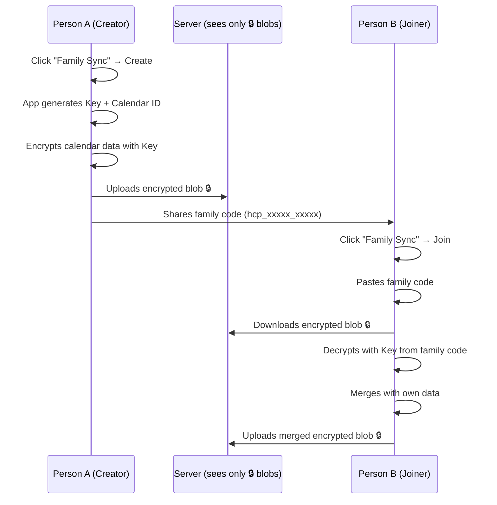
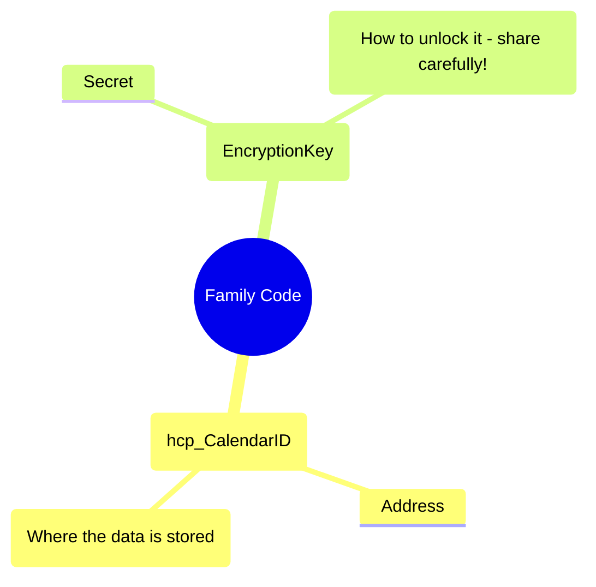
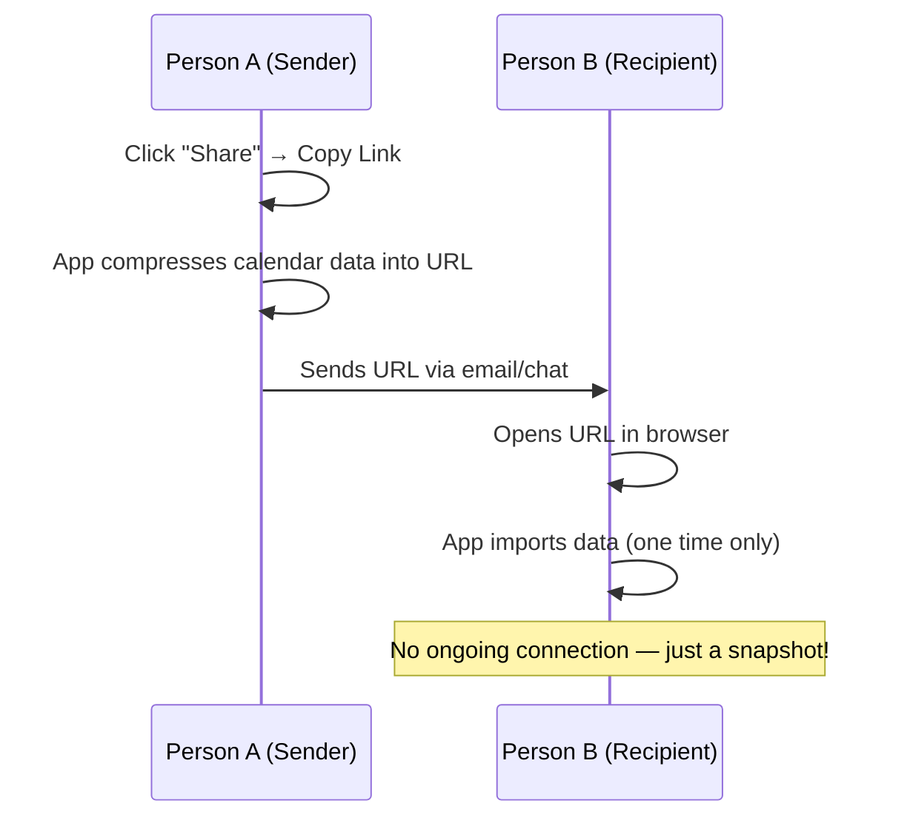

# HolidayPlanner — How to share your calendar

HolidayPlanner offers two ways to share your calendar with family and friends. Depending on whether you want to work together on the same calendar or just show someone a quick snapshot, you can choose between **Family Sync** and **Copy Link**.

---

## 🔒 Family Sync (E2EE)
**Best for: ongoing family collaboration**

Family Sync creates a persistent, secure connection between multiple devices. Everyone with the family code can view and edit the same calendar.

### How it works
1. **Create:** One person starts a "Family Sync" and gets a unique **Family Code**.
2. **Share:** You send this code to your family members (e.g., via Signal, WhatsApp, or email).
3. **Join:** They paste the code into their app, and instantly see your calendar.
4. **Sync:** Any changes made by anyone are merged and shared with everyone else.

### Security
Your data is **End-to-End Encrypted (E2EE)**. This means the calendar is locked with a secret key *before* it leaves your browser. The server only sees encrypted "blobs" and has no way to read your plans.

### Step-by-Step Flow

### Understanding the Family Code
The Family Code is the "key" to your data. It contains two parts:

---

## 📋 Copy Link (Clipboard Share)
**Best for: quickly showing someone your current state**

Clipboard Share is a one-time "snapshot" of your calendar. It's like taking a photo and sending it to someone.

### How it works
1. **Copy:** You click "Share" → "Copy Link".
2. **Send:** You send the long URL to someone.
3. **Import:** When they open the link, the app imports your data into their browser.

### Key difference
There is **no ongoing connection**. If you change your calendar later, the other person won't see the updates unless you send a new link. Also, this method is **not encrypted** — the data is packed directly into the URL.

### Step-by-Step Flow

---

## Comparison Table

| Feature | Family Sync (E2EE) | Copy Link (Clipboard) |
| :--- | :--- | :--- |
| **Encryption** | ✅ AES-256 (Private) | ❌ None (Public link) |
| **Ongoing Connection** | ✅ Yes | ❌ No (One-time import) |
| **Both can edit** | ✅ Yes | ❌ No |
| **Server stores data** | ✅ 180 days | ❌ Never |
| **How to share** | Family code (`hcp_...`) | URL link |
| **Who can see data** | Only people with the key | Anyone with the link |
| **Best for** | Family collaboration | Quick snapshot share |

---

## FAQ

**Can the server read my calendar?**
No. When using Family Sync, all data is encrypted on your device before it is sent to the server. The server never sees your names, holidays, or dates.

**What if I lose the family code?**
Don't worry! You can copy it again at any time from the **Family Sync** status screen in your app.

**What happens after 180 days?**
If nobody uses the calendar for 180 days, the server deletes the encrypted backup to save space. To refresh it, simply click "Push" or "Sync" in the app.

**Is the "Copy Link" safe to share publicly?**
No. The link contains your calendar data in a readable (though compressed) format. Only share it with people you trust. For private sharing, always use **Family Sync**.

---

*For more technical details, see the [Technical Architecture Guide](./technical-architecture.md).*
