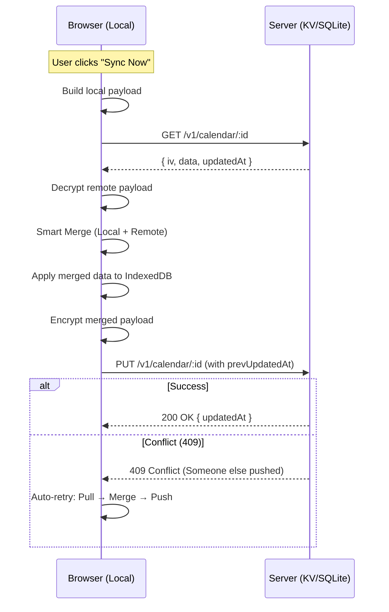

# Technical Architecture: HolidayPlanner Sync & Share

This document provides a deep dive into the synchronization and sharing mechanisms of HolidayPlanner, intended for developers and security auditors.

---

## 1. Crypto Layer (`src/sync/crypto.js`)

HolidayPlanner uses the Web Crypto API for all cryptographic operations.

*   **Algorithm:** AES-256-GCM (authenticated encryption).
*   **Key Generation:** `crypto.subtle.generateKey({ name: 'AES-GCM', length: 256 }, true, ['encrypt', 'decrypt'])`.
*   **IV (Initialization Vector):** 96-bit random per message (`crypto.getRandomValues(new Uint8Array(12))`).
*   **Key Encoding:** `base64url` (43 characters).
*   **Family Code Format:** `hcp_<calendarId-22chars>_<key-43chars>`
    *   Example: `hcp_vW6_X_yZ1234567890ABCD_A1B2C3D4E5F6G7H8I9J0K1L2M3N4O5P6Q7R8S9T0U1V`
    *   Validated by Regex: `^hcp_([A-Za-z0-9_-]{22})_([A-Za-z0-9_-]{43})$`

---

## 2. Family Sync Data Flow (`src/sync/family-sync.js`)

Family Sync follows an offline-first, smart-merge approach.

### Full Sync Sequence


---

## 3. Payload Schema

### Encrypted Payload (Server-side)
```json
{
  "iv": "<base64url-16chars>",
  "data": "<base64url-encrypted-blob>",
  "updatedAt": "2026-01-15T10:30:00.000Z"
}
```

### Decrypted Plaintext (Client-side)
```json
{
  "year": 2026,
  "persons": [
    {"id": 1, "name": "Alice", "category": "worker", "gemeinde": "ch_zh", "color": "#ff0000"}
  ],
  "holidays": [
    {"personId": 1, "date": "2026-01-01", "source": "menu", "label": "New Year"}
  ],
  "leaves": [
    {"label": "Ski Trip", "startDate": "2026-02-10", "endDate": "2026-02-15", "personIds": [1]}
  ],
  "tombstones": [
    {"sig": "Ski Trip|2026-02-10|2026-02-15", "deletedAt": "2026-01-20T12:00:00Z"}
  ],
  "updatedAt": "2026-01-15T10:30:00.000Z"
}
```

---

## 4. Smart Merge Algorithm

The merge strategy ensures data consistency across devices without a central authority.

*   **Persons:** Union by signature `name|category|gemeinde`. Local IDs are rebuilt (1, 2, 3...) to ensure continuity.
*   **Holidays:** Keyed by `personId|date`. Conflicts are resolved by timestamp; otherwise, remote wins (with local fallback). `personIds` are remapped to match the merged persons list.
*   **Leaves:** Union by signature `label|startDate|endDate`. `personIds` are remapped.
*   **Tombstones:** Merged and deduplicated by signature. Pruned after 60 days.

### Tombstone Mechanism (`src/sync/tombstone.js`)
Tombstones prevent deleted leaves from reappearing during a sync. When a user deletes a leave, a "tombstone" (signature + timestamp) is recorded. During merge, any leave matching a tombstone signature is excluded.

---

## 5. Clipboard Share (`src/share/share.js`)

Clipboard Share uses URL parameters for one-time data transfer.

*   **Format:** `?share=<payload>`
*   **Compression:** `CompressionStream('deflate')`
*   **Encoding:** `base64url`
*   **Security Warning:** This method has **no encryption**. Data is public to anyone with the link.
*   **Payload Abbreviation:** Keys are shortened (e.g., `p` for persons, `n` for name) to keep URLs short.

---

## 6. Backend API Reference

The system supports two backends: Cloudflare Workers (KV) and a self-hosted VPS (Node.js + SQLite).

### Endpoints

| Method | Path | Auth | Description |
| :--- | :--- | :--- | :--- |
| `GET` | `/v1/calendar/:id` | `X-HCP-Client` | Fetch encrypted blob |
| `PUT` | `/v1/calendar/:id` | `X-HCP-Client` | Store encrypted blob |

### PUT Request Body
```json
{
  "iv": "string (base64url, 16 chars)",
  "data": "string (base64url, min 32 chars)",
  "prevUpdatedAt": "ISO string (optional — for optimistic locking)"
}
```

### Response Codes
*   **200:** Success
*   **404:** Calendar not found
*   **409:** Conflict (updatedAt mismatch)
*   **413:** Payload too large (>256 KB on CF, >512 KB on VPS)
*   **429:** Rate limited

### Security Controls
*   **Origin Allowlist:** CORS protection.
*   **X-HCP-Client Token:** Mandatory shared secret between frontend and backend.
*   **Rate Limiting:** 30 req / 10 min (CF) or 60 req / 10 min (VPS).
*   **TTL:** 180 days auto-deletion.

---

## 7. Data Storage Map

| Component | Storage Location | Expiration |
| :--- | :--- | :--- |
| Calendar Data | IndexedDB (Browser) | Persistent |
| Family Code | `localStorage` | Until "Leave" |
| Remote `updatedAt` | `localStorage` | Until "Leave" |
| Tombstones | `localStorage` | 60 days |
| Encrypted Blobs | Cloudflare KV / SQLite | 180 days |

### IndexedDB Schema (`src/db/schema.js`)
*   **`persons`:** `{ id, name, category, gemeinde, gemeindeName, color, year }`
*   **`holidays`:** `{ id, personId, date, source, label, year }`
*   **`leaves`:** `{ id, label, startDate, endDate, personIds, year }`

---

## 8. Security Properties

| Property | Family Sync | Clipboard Share |
| :--- | :--- | :--- |
| **Confidentiality** | AES-256-GCM | None |
| **Integrity** | GCM Auth Tag | None |
| **Server Blind** | Yes | N/A |
| **Key Location** | Never leaves browser | N/A |
| **Replay Protection** | `updatedAt` Optimistic Lock | N/A |

---

*For user instructions, see the [Human-Readable Sharing Guide](./sharing-guide.md).*
